# 01 — Architecture Inventory

## Stack

- **Mobile:** Expo SDK `~56.0.9`, React Native `0.85.3`, React `19.2.3`, expo-router `~56.2.9`, New Architecture default-on. Managed/CNG workflow — **no committed `ios/` or `android/`** (generated at EAS build).
- **Local store:** AsyncStorage. Key `cym.db.v1` is the source-of-truth graph; sidecar keys hold device-local view state (see `03`).
- **Backend:** Supabase — Postgres (23 migrations) + 16 Deno edge functions (`verify_jwt=false`, manual auth each). Project ref `jvuvuukvgunhpemrhqxl`.
- **Auth:** Supabase Auth — email/password, Sign in with Apple (native iOS / web OAuth), Google (browser OAuth). Session persisted in AsyncStorage (native) / localStorage (web).
- **Billing:** RevenueCat (`react-native-purchases` 10.4.1), single entitlement `plus`. Server truth kept via `revenuecat-webhook`.
- **Notifications:** Expo push (`expo-notifications`) + local notifications; tokens in `push_tokens`; `daily-nudges` cron sends.
- **Email integration:** Gmail (metadata-scope OAuth) + generic IMAP (app passwords). Metadata only — never message bodies.
- **Enrichment:** Hunter.io + NinjaPear/Nubela (Plus, per-email), plus Tier-0 header harvest.
- **AI features:** Anthropic Messages API server-side only — drafts (`claude-sonnet-5`), card scan (`claude-opus-4-8`), contact classify (`claude-haiku-4-5`).
- **Analytics / crash SDKs:** **NONE.** No Sentry/Firebase-Analytics/Amplitude/Segment/etc. (Confirmed in `package.json` and the compiled web bundle.) No IDFA, no App Tracking Transparency surface.
- **Marketing/web:** Cloudflare Worker `workers/router.ts` (getcym.app) + static `site/`; RN-web export at `app.getcym.app`.

## Identifiers

- iOS bundle / Android package: **`app.getcym.cym`** (match).
- Scheme: `callyourmom://`. EAS project `b120ed2f-b9d9-47a9-8749-a168f582f503`. Google (Firebase) project `call-your-mom-4340c`.
- Store version (app.json): `0.1.0`. Reconciled `package.json` to match (was `1.0.0`).

## Component / data-flow diagram

```mermaid
flowchart TD
  subgraph Device
    AB[Device Address Book]
    App[Call Your Mom app]
    AS[(AsyncStorage cym.db.v1)]
    App <--> AS
    App <-->|expo-contacts read/write| AB
  end

  subgraph Supabase
    Auth[Supabase Auth]
    DB[(Postgres + RLS)]
    subgraph EdgeFns[Edge Functions verify_jwt=false]
      F1[drafts]
      F2[card-scan]
      F3[classify-contacts]
      F4[enrich-contact]
      F5[gmail-auth-start/callback]
      F6[gmail-sync / imap-sync]
      F7[daily-nudges]
      F8[share-card / card-refresh]
      F9[wallet-pass]
      F10[revenuecat-webhook]
      F11[delete-account]
      F12[attribution / waitlist]
    end
  end

  App -->|JWT| Auth
  App -->|whole-graph pull/push, JWT+RLS| DB
  App -->|JWT| F1 & F2 & F3 & F4 & F6 & F11
  App -->|token capability| F8 & F9

  F1 & F2 & F3 -->|prompt / card photo / directory fields| Anthropic[Anthropic API]
  F4 -->|contact email| Hunter[Hunter.io] & Ninja[NinjaPear/Nubela]
  F5 & F6 -->|OAuth + metadata headers| Google[Google / Gmail API]
  F6 -->|app password over TLS| IMAP[User IMAP host]
  F7 -->|push token + first-name copy| Expo[Expo Push]
  F9 -->|card fields| GWallet[Google Wallet] 
  RC[RevenueCat] -->|webhook: entitlement| F10
  F10 --> DB

  subgraph Cloudflare
    W[router.ts getcym.app]
  end
  Browser[Web visitor] --> W
  W -->|/c/token| F8
  W -->|/api/waitlist,affiliate| F12
```

## User roles / authorization boundaries

- **Single role:** authenticated end user. No admin/staff role in the app. All data is user-owned and isolated by `user_id` via RLS (`auth.uid() = user_id`) on every graph table.
- **Service role** (`SUPABASE_SERVICE_ROLE_KEY`): server-only, used inside edge functions; **never shipped to the client** (verified in `04`/`07`). Secret tables (`gmail_credentials`, `imap_credentials`, `hunter_cache`, usage counters, etc.) are reachable only via service role.
- **Public/capability endpoints:** `share-card`, `card-refresh`, `wallet-pass` are intentionally unauthenticated — the random 128-bit share token is the capability; they return card-safe fields only, never ids.

## Environments

- Build profiles (`eas.json`): `development`, `preview`, `beta`, `production`. `preview`/`beta`/`production` share an identical `EXPO_PUBLIC_*` env block (all public keys). `beta`+`production` set `autoIncrement`.
- Feature flags: none dynamic. One hardcoded beta-period gate — Health tab Pro-gate removed for beta (`dashboard.tsx`); marketing `/beta` install page behind a shared worker password.
